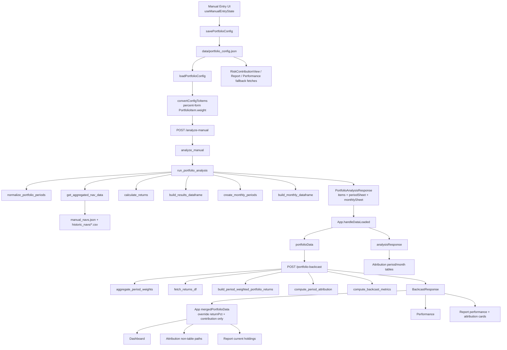

# Weights, Returns, and Contributions Audit

## Scope

This audit traces the live app path only:

- `client/`
- `server/`

Reference code in `Return_Contribution_Python/` is not part of the runtime path. That is reinforced by `server/test_reference_repo_isolation.py`.

## Executive Summary

- Weight source of truth is the saved manual portfolio config.
- `/analyze-manual` is the canonical analysis pass that expands rebalance dates, loads prices/NAVs, computes period and monthly attribution, and returns the flat `items` list plus `periodSheet` and `monthlySheet`.
- `App.tsx` then calls `/portfolio-backcast` from the analyzed `items` set and overlays backcast-derived period attribution back onto the flat `PortfolioItem[]`.
- Most screens do not consume a single unified dataset. The app uses a hybrid of:
  - analyzed flat items
  - analyzed period/month sheets
  - backcast series and backcast period attribution
  - separate risk and market-data fetches

## Runtime Scheme

## Source-of-Truth Map

| Stage | Code anchor | Output | Notes |
| --- | --- | --- | --- |
| Manual config editor | `client/components/manual-entry/useManualEntryState.ts` | `tickers[]`, `periods[]` | Human-entered weights are stored as strings like `"12.50"` or `"0.50%"`. |
| Persist config | `client/services/api.ts -> savePortfolioConfig` -> `server/routes/config.py -> /save-portfolio-config` | `data/portfolio_config.json` | This is the durable source of portfolio weights and rebalance dates. |
| Rehydrate config | `loadPortfolioConfig` + `convertConfigToItems` | flat `PortfolioItem[]` | `convertConfigToItems` strips `%` and emits numeric weights in percent-form, not decimal-form. |
| Canonical analysis pass | `server/routes/portfolio.py -> analyze_manual -> run_portfolio_analysis` | `PortfolioAnalysisResponse` | This is the only path that builds `periodSheet` and `monthlySheet`. |
| Shared backcast pass | `server/routes/risk.py -> /portfolio-backcast` | `BackcastResponse` | Recomputes returns from daily chained data and returns `periodAttribution`. |
| Shared app state | `client/App.tsx` | `portfolioData`, `analysisResponse`, `backcastData`, `mergedPortfolioData` | `mergedPortfolioData` preserves metadata from `/analyze-manual` and overwrites only `returnPct` and `contribution`. |

## End-to-End Weight Flow

### 1. Weights are entered and persisted

1. `useManualEntryState` loads saved config with `loadPortfolioConfig`.
2. The editor modifies `tickers` and `periods`.
3. `handleSubmit` calls `convertConfigToItems` and `savePortfolioConfig`.
4. The backend writes the config through `/save-portfolio-config`.

### 2. The config is flattened into API items

`client/services/api.ts -> convertConfigToItems` does the following:

- iterates every `period`
- iterates every `ticker`
- reads `period.weights[ticker]`
- strips `%` if present
- parses to a number
- emits a `PortfolioItem` with:
  - `ticker`
  - `date = period.startDate`
  - `weight = numeric percent-form value`
  - `isMutualFund`, `isEtf`, `isCash`

Example:

- config weight `"12.50"` becomes `PortfolioItem.weight = 12.5`
- config weight `"0.50%"` becomes `PortfolioItem.weight = 0.5`

### 3. `/analyze-manual` builds the backend weight map

`server/routes/portfolio.py -> analyze_manual`:

- groups incoming items into `weights_dict[ticker][date]`
- parses date strings to `Timestamp`
- keeps numeric weights as-is
- divides by `100` only when the incoming weight is a string containing `%`

Because the live frontend sends numeric values, the web path feeds percent-form weights into `weights_dict`.

### 4. Weight dates are normalized

`server/services/period_normalizer.py -> normalize_portfolio_periods`:

- normalizes all dates to midnight
- prepends the prior month-end if the first boundary is the first day of a month
- inserts missing month-end boundaries between rebalance dates
- carries the latest known weights forward onto every synthetic date
- extends the series to today, or adds a one-day synthetic end if the last date is today or future

This normalization is critical because it creates the period chain used by:

- period attribution
- monthly attribution
- YTD rollups

## Return Calculation Flow

### Price and NAV sources

`server/routes/portfolio.py -> get_aggregated_nav_data` and `server/services/backcast_service.py -> load_backcast_nav_data` both merge:

- `data/manual_navs.json`
- `data/historic_navs/*.csv`

with `merge_nav_sources`.

### Instrument price resolution

`server/market_data.py`:

- `get_price_on_date` uses `yfinance` close history plus cache
- `get_nav_price_on_or_before` resolves mutual fund NAVs with exact-date lookup first, then prior-date lookup within `NAV_LOOKBACK_WINDOW_DAYS = 10`
- `needs_fx_adjustment` returns:
  - `false` for cash
  - `false` for mutual funds / NAV-backed tickers
  - `false` for `.TO` and `^GSPTSE`
  - `true` for the remaining US-listed names

### Period return math in `/analyze-manual`

`server/market_data.py -> calculate_returns`:

- loads start and end prices for each normalized boundary
- computes `price_return = (end / start) - 1`
- applies FX with `apply_fx_adjustment` when required
- assigns cash a hardcoded `0.0`

The output is:

- `returns[ticker][(start_date, end_date)] = decimal return`
- `prices[ticker][date] = resolved price or NAV`

## Contribution Calculation Flow

### Period contribution in `/analyze-manual`

`server/market_data.py -> build_results_dataframe`:

- reads the weight at each period `start_date`
- reads the period return for `(start_date, end_date)`
- computes `contribution = weight * period_return`

It also computes:

- `YTD_Return` from first price to last price, with FX when required
- `YTD_Contrib` with `forward_compounded_contribution`

### Monthly contribution in `/analyze-manual`

`server/market_data.py -> build_monthly_dataframe`:

- builds calendar-month buckets from the normalized period chain
- computes monthly return from month boundary prices
- computes monthly contribution by forward-compounding all sub-period contributions inside the month
- computes monthly `YTD_Contrib` with `forward_compound_series`

### Backcast contribution path

`server/routes/risk.py -> /portfolio-backcast` uses a different return engine:

1. `aggregate_period_weights` groups items by date.
2. It divides weights by `100` and normalizes the period weights to sum to `1`.
3. `fetch_returns_df` loads daily returns for all required tickers.
4. `build_period_weighted_portfolio_returns` compounds daily portfolio returns using period-specific weights.
5. `compute_period_attribution` derives per-period ticker returns from the same daily series.

This is the path used to keep:

- cumulative performance series
- portfolio metrics
- period attribution overrides

internally consistent with each other.

## Runtime Contract and Units

| Artifact | Weight unit | Return unit | Contribution unit | Produced by |
| --- | --- | --- | --- | --- |
| `period.weights[ticker]` in config | string percent | n/a | n/a | manual editor |
| `PortfolioItem.weight` from `convertConfigToItems` | percent-form number | n/a | n/a | client |
| `weights_dict` in `/analyze-manual` live web path | percent-form number | n/a | n/a | backend |
| `periodSheet[].periods[].weight` in live `/analyze-manual` path | percent-form number | decimal | percentage points | backend |
| `items[].weight` from `/analyze-manual` | percent-form number | decimal | percentage points | backend |
| `periodAttribution[].weight` from `/portfolio-backcast` | percent-form number | decimal | percentage points | backend |
| `risk.positions[].weight` from `/risk-contribution` | percent-form number | annualized percent | percent of total risk / other risk units | backend |

### Practical interpretation

- Weight `12.5` means `12.5%`.
- Return `0.04` means `4.0%`.
- Contribution `0.5` means `0.50%`, which is `50 bps`.
- `client/utils/formatters.ts -> formatBps` multiplies contribution by `100`, so `0.5` becomes `50`.

## How the App Gets Populated

## A. Boot path in `App.tsx`

1. `App.tsx` loads:
   - sector weights
   - asset geography
   - saved portfolio config
2. It calls `convertConfigToItems`.
3. It sends those items to `analyzeManualPortfolioFull`.
4. `handleDataLoaded` stores:
   - `portfolioData = response.items`
   - `analysisResponse = full response`
5. A second effect immediately calls:
   - `fetchPortfolioBackcast(portfolioData, '75/25', true)`
   - benchmark variants for `TSX`, `SP500`, `ACWI`
6. `mergedPortfolioData` is built by overriding only:
   - `returnPct`
   - `contribution`

on top of the analyzed flat items.

## B. View-by-view population

| View | Primary dataset | Secondary fetches | Notes |
| --- | --- | --- | --- |
| Upload | analyzed `PortfolioItem[]` | NAV audit, lag checks, sector save/load, geo save/load | This is the entry point for loading and refreshing the portfolio. |
| Dashboard | `mergedPortfolioData` | sectors, betas, dividends, benchmark exposure, risk contribution | Uses merged holdings for current weights and extra endpoints for enrichments. |
| Attribution | `analysisResponse.periodSheet`, `analysisResponse.monthlySheet`, `analysisResponse.monthlyPeriods`, `sharedBackcast`, `mergedPortfolioData` | sectors, benchmark exposure, sector history | This view is hybrid. Tables lean on `analysisResponse`; some totals/charts use backcast or merged data. |
| Performance | `sharedBackcast` / prefetched benchmark backcasts | benchmark exposure, sectors, asset geo fallback | Primarily driven by `/portfolio-backcast`. |
| Report | `sharedBackcast` + `mergedPortfolioData` | risk contribution, benchmark exposure, sectors, config fallback | Current holdings come from merged data; performance and attribution cards use backcast data. |
| Risk Contribution | config -> `convertConfigToItems` -> `/risk-contribution` | none beyond its own endpoint | Does not use `mergedPortfolioData`. It recomputes from saved config. |

## Key Behaviors Confirmed by Static Trace

- Cash weight is preserved in the allocation and earns `0%`; it is not normalized away.
- Mutual funds and NAV-backed tickers use NAV history, not `yfinance`, and do not get FX adjustment.
- US-listed non-NAV tickers get USD-to-CAD FX adjustment.
- `/analyze-manual` and `/portfolio-backcast` are separate calculation paths.
- The shared backcast is intended to be the performance-consistent override layer on top of the analyzed flat items.

## Audit Findings and Drift Risks

### 1. Unit convention drift exists

Static trace shows a real convention split:

- the live web path feeds percent-form weights into `/analyze-manual`
- `aggregate_period_weights` and `aggregate_weights` explicitly convert percent-form to decimals before backcast/risk math
- `server/models.py` comments and `server/test_attribution_math.py` describe decimal-weight conventions for sheet rows and helper math

That means helper docs/tests and live app payloads are not expressing a single canonical unit contract.

### 2. Attribution is populated from multiple sources

The app does not use one attribution dataset everywhere:

- `mergedPortfolioData` gets backcast overrides
- `AttributionView` period and monthly tables still use `analysisResponse.periodSheet` and `analysisResponse.monthlySheet`
- `client/views/attribution/canonicalAttribution.ts` prefers `analysisResponse.items` over merged items when monthly sheets exist

If one path changes and the other does not, the UI can drift.

### 3. Screen hydration is split across state and re-fetches

Some views render from `App` state, while others re-load the saved config and call their own endpoints again. That increases the number of places where date semantics and weight normalization must stay aligned.

### 4. The most sensitive semantic boundary is the meaning of `PortfolioItem.date`

In the shared `App` path:

- `portfolioData` comes from `/analyze-manual`
- dates therefore represent analyzed period-end dates

In config rehydration paths:

- `convertConfigToItems` emits `date = period.startDate`

That distinction matters because backcast logic groups and applies weights by item date. The shared app flow avoids this by using analyzed items for the pre-fetched backcasts.

## Validation Run

I ran the backend math and isolation tests relevant to this audit:

- `pytest server/test_attribution_math.py server/test_period_normalizer.py server/test_backcast_nav_handling.py -q`
  - Result: `9 passed`
- `pytest server/test_reference_repo_isolation.py -q`
  - Result: `2 passed`

## Bottom Line

The live population chain is:

`portfolio_config.json` -> `convertConfigToItems` -> `/analyze-manual` -> `portfolioData + analysisResponse` -> `/portfolio-backcast` -> `mergedPortfolioData` -> view-specific rendering and enrichment.

The main architectural risk is not the math helpers themselves. The main risk is contract drift between:

- percent-form vs decimal-form weight conventions
- analyzed sheet data vs backcast-derived override data
- state-driven views vs config-reloaded views
